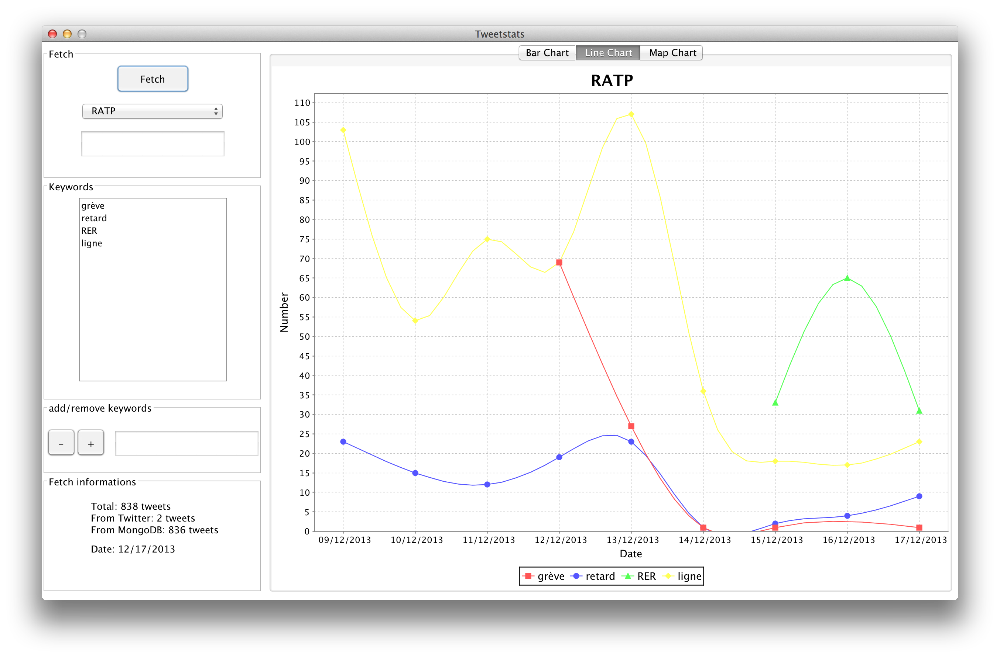

# TweetStats

Assignment for the Software Quality course at ECE Paris 2013 with Lom Hillah. Show trends of keywords related to a given brand.



- [Requirements Specifications](https://github.com/thibaultCha/TweetStats/wiki/Requirements-Specifications)
- [Design Specifications]()

## Instructions for installation

Requires MongoDB. By default, TweetStats will look for the MongoDB server at `localhost:27017`, but you can override it by editing `spring.properties` and recompile the project:

```
mongodb.dbname=TweetStats
mongodb.url1=localhost:27017
```

If MongoDB is up and running:

1. Open the `.dmg`
2. Drag and drop the application to your `Applications` folder
3. Open the application (make sure MongoDB is running)

That's it.

:warning: `Unable to invoke main method` means that your MongoDB server is NOT running.

## Instructions for build and development

Requires JDK 1.7.0 update 9 or higher and Maven 3.

1. Set your `JAVA_HOME` to JDK 1.7
2. Add javafx to Maven:

    - Read the version number of javafx in `${JDK7_HOME}/jre/lib/javafx.properties`

    - Run:

```
mvn install:install-file \
  -Dfile=${JDK7_HOME}/jre/lib/jfxrt.jar \
  -DgroupId=com.oracle \
  -DartifactId=javafx \
  -Dpackaging=jar \
  -Dversion=${JAVAFX_VERSION}
```
    
   Check the javafx version number in `pom.xml` (current is `2.2.45`) and update if needed.
    
You can now compile the project under Eclipse.

### Native installer

1. Install [JavaFX Maven Plugin](http://zenjava.com/javafx/maven/):

    - `mvn com.zenjava:javafx-maven-plugin:2.0:fix-classpath`

To compile the project as a native installer, run the `build.sh` script.

Be careful: in order to successfully run the unit tests while maven will compile the project, you need to start your MongoDB server.

## Instructions to generate the Data Model source code

This part of the project is handled by [Sculptor](sculptorgenerator.org).

- Make any change in `model.btdesign` (optional)

- Run the following command at the root of the project:

```
mvn generate-sources -Dsculptor.generator.force=true
```

